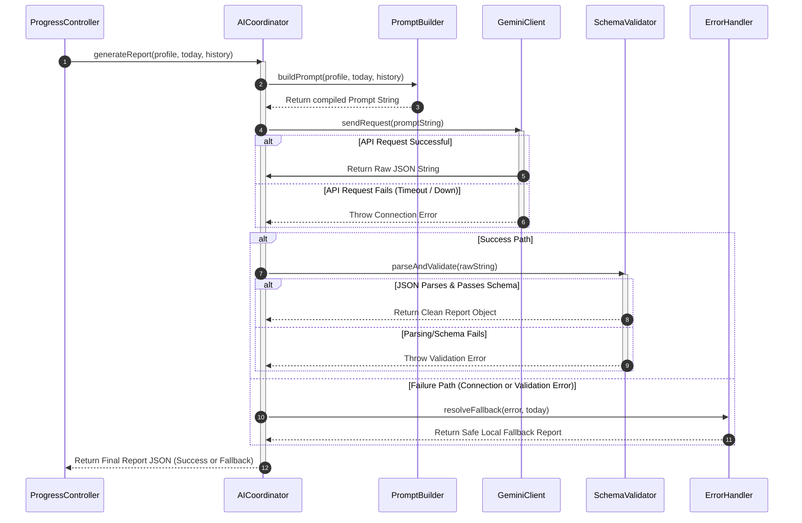

# FitAI-X: Progress Tracker — AI Module Architecture
## Senior Software Architect Design Document

This document outlines the software architecture, design patterns, file responsibilities, and components of the **AI Module** in the FitAI-X backend. The module is written in Node.js with TypeScript and is responsible for managing all prompt construction, communication with the Google Gemini API, response validation, and failure recovery.

---

### 1. Purpose of the AI Module
The AI Module serves as an isolated, self-contained engine within the FitAI-X backend. Its primary purpose is to decouple all artificial intelligence concerns—such as prompt engineering, LLM request lifecycle, and safety enforcement—from the core business controllers and data access layers.

By isolating the AI logic:
*   Changes to the prompt or model version do not impact backend routing or database transactions.
*   Model failure states can be intercepted and handled gracefully with predictable fallbacks.
*   The module can be tested in isolation using mock LLM inputs and outputs.
*   System latency and token usage can be audited centrally.

---

### 2. Responsibilities of the AI Module
The module is responsible for the following operations:
1.  **Payload Aggregation**: Consolidating user profile parameters, today's metrics, and historical logs into the correct structure.
2.  **Context-Aware Prompt Building**: Compiling dynamic prompt templates containing target values, guidelines, and localized formatting keys.
3.  **LLM Communication**: Initializing the Google Gemini API client, passing parameters (temperature, safety filters, tokens), and executing requests.
4.  **Schema Enforcement & Parsing**: Converting the raw string response from Gemini into a valid TypeScript object, validating all required keys and data formats.
5.  **Error Handling & Fallback Generation**: Monitoring timeouts, rate-limits, and parsing errors, and returning localized fallback mockups if Gemini is offline.

---

### 3. Complete AI Architecture
The AI Module adopts the **Service Coordinator Pattern**. 
The `AICoordinator` class acts as the orchestrator (facade). Business controllers interact only with this coordinator. Internally, the coordinator delegates duties to specialized sub-services:
*   `PromptBuilder`: Standardizes input compilation.
*   `GeminiClient`: Manages connections to Google Gemini.
*   `SchemaValidator`: Checks structure and compliance.
*   `ErrorHandler`: Maps exceptions and manages fallbacks.

---

### 4. Component Diagram
The diagram below shows how the sub-modules interact inside the backend architecture:

```text
┌────────────────────────────────────────────────────────────────────────┐
│                          Node.js Backend (Express)                      │
│                                                                        │
│   ┌───────────────────────────┐                                        │
│   │    ProgressController     │                                        │
│   └─────────────┬─────────────┘                                        │
│                 │ (Calls with Profile + History + Today's Log)         │
│                 ▼                                                      │
│     ┌────────────────────────────────────────────────────────────┐     │
│     │                      AICoordinator                         │     │
│     └─────┬──────────────┬──────────────┬──────────────┬─────────┘     │
│           │              │              │              │               │
│           │ (Builds      │ (Executes    │ (Validates   │ (Handles      │
│           │  Prompt)     │  Request)    │  JSON)       │  Errors)      │
│           ▼              ▼              ▼              ▼               │
│     ┌───────────┐  ┌───────────┐  ┌───────────┐  ┌───────────┐         │
│     │  Prompt   │  │  Gemini   │  │  Schema   │  │   Error   │         │
│     │  Builder  │  │  Client   │  │ Validator │  │  Handler  │         │
│     └───────────┘  └─────┬─────┘  └───────────┘  └───────────┘         │
└──────────────────────────┼─────────────────────────────────────────────┘
                           │ (HTTPS POST)
                           ▼
                 ┌───────────────────┐
                 │   Gemini AI API   │
                 └───────────────────┘
```

---

### 5. Sequence Diagram
The sequence of calls during a progress analysis request is illustrated below:



---

### 6. Data Flow Diagram
This diagram traces the conversion of user inputs into structured AI outputs:

```text
 [Raw Inputs] ──(Profile, Log, History)──> [PromptBuilder]
                                                 │
                                     (System Instructions + Payload)
                                                 ▼
[Gemini API] <──(Raw Text Request)───────── [GeminiClient]
      │
(Returns Raw Text String)
      ▼
[SchemaValidator] ──(Valid JSON Check)──> [AICoordinator] ──> [Success JSON]
      │
 (Parsing Error)
      ▼
[ErrorHandler] ──(Fallback Generation)──> [AICoordinator] ──> [Fallback JSON]
```

---

### 7. Internal AI Processing Flow
When `AICoordinator.generateReport()` is called, it executes the following logic:

1.  **Validation Check**: Confirms that profile and daily metrics are populated.
2.  **Prompt Generation**: Calls `PromptBuilder.buildPrompt()` to inject profile, logs, and targets into the context template.
3.  **Inference Invocation**: Passes the prompt string to `GeminiClient.sendRequest()`.
4.  **String Cleanup**: If Gemini returns a string wrapped in markdown fences (e.g. ` ```json `), the Coordinator cleans it.
5.  **JSON Validation**: Calls `SchemaValidator.parseAndValidate()`. If fields are missing, it attempts to assign default values.
6.  **Error Recovery**: If any step from 3 to 5 throws an exception, `ErrorHandler` catches it, logs details for developer review, and returns a standard local analysis report.

---

### 8. Communication with Backend
The AI Module exposes a clear interface boundary to the rest of the backend application. In TypeScript, this contract is defined using interfaces (without implementation code):

*   **Input Interface**:
    ```typescript
    interface AIInputPayload {
      userProfile: UserProfileDto;
      todayProgress: DailyLogDto;
      previousHistory: DailyLogDto[];
    }
    ```
*   **Output Interface**:
    ```typescript
    interface AIReportResponse {
      progressScore: number;
      confidenceScore: number;
      consistencyAnalysis: {
        status: "Excellent" | "On Track" | "Needs Attention" | "Unsatisfactory";
        completedWorkoutsCount: number;
        missedWorkoutsCount: number;
        weeklyAdherencePercentage: number;
      };
      workoutPerformance: {
        intensityLevel: "High" | "Moderate" | "Low";
        caloriesBurnedVariance: number;
        durationVariance: number;
        feedback: string;
      };
      recoveryAnalysis: {
        status: "Optimal" | "Adequate" | "Impaired" | "Critical";
        sleepQuality: "Good" | "Fair" | "Poor";
        hydrationStatus: "Optimal" | "Sub-optimal" | "Critical";
        fatigueLevel: "Low" | "Medium" | "High";
        insights: string[];
      };
      injuryRisk: {
        riskLevel: "Low" | "Moderate" | "High";
        criticalAreas: string[];
        preventativeAction: string;
      };
      userVulnerabilities: string[];
      improvementAnalysis: {
        isImproving: boolean;
        metricChanges: string[];
        primaryBottleneck: string;
      };
      goalProgress: {
        status: "Ahead of Plan" | "On Track" | "Behind Plan" | "Stagnant";
        estimatedWeeksToGoal: number | null;
        qualitativeAssessment: string;
      };
      personalizedRecommendations: Array<{
        category: "Workout" | "Diet" | "Recovery" | "Safety";
        priority: "High" | "Medium" | "Low";
        action: string;
        rationale: string;
      }>;
      motivationMessage: string;
    }
    ```

---

### 9. Communication with Gemini
The module connects to the Google Gemini API using the official Google Gen AI SDK:

*   **Model Selected**: `gemini-1.5-flash` (Optimized for fast response times and structural text extraction).
*   **Parameters Settings**:
    *   `temperature`: `0.2` (Set low to ensure output remains predictable and adheres strictly to structural directives, minimizing formatting variations).
    *   `maxOutputTokens`: `2048` (Sufficient capacity to return the full JSON analysis without cutoffs).
*   **Response Configuration**: Explicitly configures the model settings with `responseMimeType: "application/json"` to ensure the model responds with parsed JSON contents.
*   **Safety Thresholds**: Configures default safety blocks (`harmCategoryBlockThreshold: "BLOCK_MEDIUM_AND_ABOVE"`) to block medical diagnoses or dangerous training advice.

---

### 10. Communication with Frontend
*   **Data Delivery**: The backend wraps the final validated `AIReportResponse` in an HTTP envelope (`status: "success"`) and transmits it as the response to the frontend client.
*   **Fallback Signals**: If Gemini is offline, the backend returns a partial success code. The frontend client reads this structure and switches the dashboard layout to show local, database-generated metric charts instead of displaying empty panels.

---

### 11. Module Component Responsibilities

#### `PromptBuilder`
*   Compiles static system instructions (role, rules, output JSON schema, safety disclaimers).
*   Injects runtime parameters safely (removes extra carriage returns or SQL markers from subjective user logs before sending).
*   Configures instructions dynamically based on user settings (e.g. adjusts prompts based on preferred coach persona).

#### `GeminiClient`
*   Initializes connections using the Google Gen AI client library.
*   Retrieves secrets securely from environment variables.
*   Implements timeout gates (e.g. aborts requests if no response is received in 6 seconds).

#### `SchemaValidator`
*   Performs type checks on the raw JSON response.
*   Ensures values stay within expected parameters (e.g. if the score is somehow `120`, caps it to `100`).
*   Fixes minor JSON defects (such as trailing commas or incorrect quotes) before passing data back.

#### `ErrorHandler`
*   Analyzes exceptions (separates connection failures from prompt parsing issues).
*   Logs errors using the system logger (e.g. Winston).
*   Generates a safe local default analysis object so user dashboard layouts do not crash.

---

### 12. Future Scalability
To support increased traffic and future extensions, the AI Module is designed with the following scaling paths:

1.  **AI Report Caching**: Daily reports are cached in the PostgreSQL database. If a user opens their dashboard multiple times on the same date, the backend serves the cached report directly, avoiding redundant, costly API calls to Gemini.
2.  **Asynchronous Job Queue**: For bulk imports or high-load environments, analysis tasks can be queued. The backend can write the log to the database and respond immediately to the frontend. A background worker (using a library like BullMQ) compiles the AI report asynchronously and pushes updates to the client via WebSockets.
3.  **Model Versioning**: The model identifier config is stored as a variable in the environment configurations, allowing developers to switch models (e.g. from `gemini-1.5-flash` to `gemini-2.0-pro`) without modifying any service files.
4.  **Multi-Provider Fallbacks**: If the Gemini API is blocked or offline, the coordinator can automatically route requests to an alternative provider or local model instance.

---

### 13. Folder Organization
This structure shows where the files should be placed inside your Node.js + TypeScript project:

```text
src/
├── config/
│   └── ai.config.ts                      # Loads environment variables and API keys
├── controllers/
│   └── progress.controller.ts            # Route handler; queries DB and calls AICoordinator
├── services/
│   └── ai/
│       ├── ai-coordinator.service.ts     # Main orchestrator (Facade)
│       ├── prompt-builder.service.ts     # Compiles prompt templates and user context
│       ├── gemini-client.service.ts      # Wraps Gemini SDK and connection settings
│       ├── schema-validator.service.ts   # Parses and validates JSON structures
│       └── error-handler.service.ts      # Tracks logs and returns fallback templates
└── types/
    └── ai.types.ts                       # Declares all input/output TypeScript interfaces
```

---

### 14. File Responsibilities

*   [`ai.config.ts`](file:///c:/Users/hp/Desktop/Projects/fitXai-Progress-Tracker/src/config/ai.config.ts): Manages runtime configurations. Loads the Gemini API key, configures parameters (temperature, token limits), and handles development/production config switches.
*   [`progress.controller.ts`](file:///c:/Users/hp/Desktop/Projects/fitXai-Progress-Tracker/src/controllers/progress.controller.ts): The request boundary. Handles HTTP requests, manages SQL transactions in PostgreSQL, invokes the `AICoordinator`, and delivers JSON responses.
*   [`ai-coordinator.service.ts`](file:///c:/Users/hp/Desktop/Projects/fitXai-Progress-Tracker/src/services/ai/ai-coordinator.service.ts): Orchestrates logic. Coordinates prompt compilation, Gemini API calls, schema validation, and error recovery.
*   [`prompt-builder.service.ts`](file:///c:/Users/hp/Desktop/Projects/fitXai-Progress-Tracker/src/services/ai/prompt-builder.service.ts): Handles prompt engineering. Builds system templates, formats user details into clean data blocks, and ensures safety disclaimers are present.
*   [`gemini-client.service.ts`](file:///c:/Users/hp/Desktop/Projects/fitXai-Progress-Tracker/src/services/ai/gemini-client.service.ts): Manages Gemini API integration. Handles network connections, safety settings, and timeouts.
*   [`schema-validator.service.ts`](file:///c:/Users/hp/Desktop/Projects/fitXai-Progress-Tracker/src/services/ai/schema-validator.service.ts): Formats output payloads. Sanitizes Gemini strings, validates schemas, and checks data types.
*   [`error-handler.service.ts`](file:///c:/Users/hp/Desktop/Projects/fitXai-Progress-Tracker/src/services/ai/error-handler.service.ts): Manages errors. Logs exceptions, tracks performance degradation, and generates fallback reports.
*   [`ai.types.ts`](file:///c:/Users/hp/Desktop/Projects/fitXai-Progress-Tracker/src/types/ai.types.ts): Serves as the central type reference. Holds all TypeScript type definitions for inputs and outputs.

---

### 15. Best Practices
To ensure a secure and robust implementation, follow these best practices:

1.  **API Key Safety**: Never commit API keys to version control. Load keys at startup using `.env` configurations, and verify their presence during initial configuration checks.
2.  **Schema Robustness**: Do not rely on the LLM always formatting JSON perfectly. Always run inputs through a validation library (such as `zod` or `joi`) at the backend boundary before database ingestion.
3.  **Low Latency Configurations**: Use lightweight models (such as `gemini-1.5-flash`) for real-time dashboard updates to keep total transaction latency under 5 seconds.
4.  **Logging**: Log API request latencies and token usage for all AI integration calls. This helps monitor costs and identify slow responses.
5.  **Strict Type Compliance**: Ensure all properties returned by the AI are mapped to TypeScript interfaces, providing full compile-time type safety across the application.
