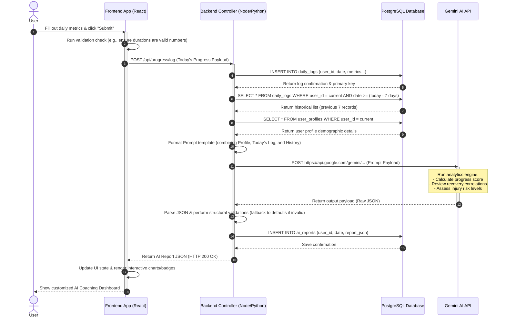

# FitAI-X: Progress Tracker Feature (AI Integration & Analysis)
## AI Feature Analysis Document

This document provides a comprehensive analysis of the **Progress Tracker** feature in the **FitAI-X** application. It details how daily user logs, historical workout data, and demographic profiles are processed by Gemini AI to deliver personalized, actionable coaching, recovery, and injury-prevention insights.

---

### 1. Purpose of the Progress Tracker Feature
The FitAI-X Progress Tracker is designed to bridge the gap between passive tracking and active, intelligent improvement. Instead of simply logging raw numbers (e.g., weights lifted, minutes spent, or ounces of water drunk), the Progress Tracker serves as a dynamic, automated fitness mentor. It evaluates the user's daily habits and workouts in the context of their long-term objectives (e.g., Muscle Gain, Weight Loss) and their physical recovery indicators (sleep, hydration, injury status).

By leveraging generative AI, the feature synthesizes disparate metrics into a cohesive daily analysis. This helps users:
*   Understand the immediate impact of their daily choices.
*   Correlate recovery metrics with workout performance.
*   Remain motivated through personalized positive reinforcement.
*   Prevent injury and physical burnout through proactive fatigue tracking.

---

### 2. Problems This AI Feature Solves
Standard fitness logs suffer from several critical shortcomings that AI integration solves:

1.  **Metric Isolation (Disconnected Data)**: Traditional applications log sleep, water, and workouts in separate tabs. Users fail to see how a bad night’s sleep directly reduces their workout duration the next day. The AI automatically connects these variables.
2.  **Generic, Non-Actionable Targets**: Static apps give standard recommendations (e.g., "Drink 8 glasses of water daily"). The AI adapts dynamically: if a user logs an intense, long-duration workout under hot conditions, the AI will increase the water target based on their specific weight and activity level.
3.  **Lack of Injury Prevention Warnings**: Fitness enthusiasts frequently ignore warning signs like cumulative fatigue or ascending pain. The AI tracks patterns over consecutive days and warns users of high injury risks before a physical strain occurs.
4.  **The "Cold Number" Disconnection**: Raw logs do not offer context. A user who completes a 40-minute workout might feel discouraged compared to an hour-long session, but the AI can point out that their performance was highly efficient given their sleep status or type of workout.
5.  **Information Fatigue**: Users do not want to analyze charts to figure out if they are improving. The AI generates a natural language summary that synthesizes the complex data into three bullet points.

---

### 3. User Journey
The user interacts with the Progress Tracker in a structured, seamless loop:

1.  **Dashboard Access**: The user opens the FitAI-X application and navigates to the **Progress Tracker** tab.
2.  **Daily Log Submission**: The user fills out a simple daily progress form covering:
    *   Whether they completed a workout today.
    *   Workout type (e.g., Chest, Back, Cardio), duration (minutes), and estimated calories burned.
    *   Recovery metrics: water intake (liters), sleep hours, mood, and subjective energy level (1–10).
    *   Injury status (yes/no), pain levels (0–10), and subjective notes (e.g., *"Legs felt stiff today"*).
3.  **Submission & Transition**: The user taps "Submit Today's Progress". The screen transitions to a loading animation with messages like: *"Analyzing your logs...", "Comparing with your weekly benchmarks...", "Gemini AI is generating your report..."*.
4.  **Dashboard Refresh**: Within seconds, the dashboard displays the daily **AI Progress Report**:
    *   **Progress Score (0–100)**: A large visual gauge showing overall performance.
    *   **Consistency Ring**: Highlighting the completed vs. missed days out of the past week.
    *   **Traffic Light Statuses**: Quick indicators for progress improvement, recovery, and injury risk.
    *   **Vulnerability Alerts**: Attention-grabbing cards warning the user of low hydration or recovery.
    *   **Tailored Recommendations**: Direct actions the user should take today (e.g., *"Add 500ml water before sleep"* or *"Prioritize 8 hours of sleep tonight"*).
    *   **Narrative AI Summary**: A human-like coaching paragraph summarizing their state.

---

### 4. End-to-End Workflow

The following technical workflow runs behind the scenes:

1.  **User Submission**: The user fills and submits the logging form.
2.  **Frontend Validation**: The client validates fields (e.g., duration cannot be negative; sleep hours must be between 0 and 24).
3.  **Backend Store (Today's Data)**: The backend receives the data and inserts the record into the PostgreSQL database.
4.  **Context Aggregation**: The backend queries PostgreSQL to retrieve:
    *   The user's static/demographic profile (age, gender, height, weight, fitness goal, experience level).
    *   The previous 7 days of daily progress logs.
5.  **Prompt Assembly**: The backend builds a structured input JSON containing the User Profile, Today's metrics, and the Previous History.
6.  **AI Invocation**: The backend feeds the payload to the Gemini API, alongside a detailed system prompt outlining rules (e.g., strict JSON return, no markdown block wrappers).
7.  **Inference**: Gemini AI analyzes the payload to determine progress trends, recovery quality, and injury liabilities.
8.  **Strict Output Extraction**: Gemini returns a raw, un-wrapped JSON payload matching the expected output schema.
9.  **Backend Cache/Save**: The backend parses the JSON, performs safety checks, and stores the AI Report in PostgreSQL.
10. **Delivery**: The backend sends the parsed JSON data back to the Frontend.
11. **UI Render**: The Frontend processes the JSON properties to render visual cards, progress gauges, and text.

---

### 5. AI Responsibilities
The Gemini AI engine has the following primary analytical responsibilities:

*   **Consistency Analysis**: Evaluating the user's weekly workout frequency against their experience level and goals, noting completed vs. missed days.
*   **Trend Identification**: Analyzing whether performance (e.g., workout duration, energy levels, mood) is improving, plateauing, or declining compared to the history.
*   **Correlative Recovery Check**: Evaluating whether sleep deficits or dehydration correlate with decreases in physical metrics (e.g., lower workout durations or higher fatigue levels).
*   **Injury Risk Detection**: Classifying injury risk (Low, Medium, High) based on recent workouts, reported pain levels, and subjective notes.
*   **Structured Output Compliance**: Ensuring that all output values conform strictly to the required schema (correct key names, data types, and formatting guidelines) and avoiding verbose explanations outside the JSON object.
*   **Actionable Coach persona**: Generating brief, highly encouraging, and medically safe recommendations.

---

### 6. Backend Responsibilities
The application backend serves as the orchestration layer between the user interface, the database, and the AI service:

*   **API Endpoints**: Providing endpoint routing (e.g., `POST /api/progress/log` and `GET /api/progress/report/:date`).
*   **Validation & Sanitization**: Filtering database inputs to prevent SQL injection and checking metric limits (e.g., preventing pain levels over 10).
*   **Database Querying**: Fetching the user's historical progress data and profile details from PostgreSQL efficiently.
*   **AI SDK Management**: Securely loading Gemini API keys, setting appropriate request timeouts (e.g., 8 seconds), and constructing the prompt templates.
*   **AI Response Processing**: Parsing the raw AI response, removing any accidental markdown wrappers (such as ` ```json `), validating keys, and generating fallback data if parsing fails.
*   **Caching & Optimization**: Caching report requests to prevent unnecessary, costly calls to Gemini if a user reviews their daily report multiple times.

---

### 7. Frontend Responsibilities
The React frontend manages the visual presentation and the user experience loop:

*   **Form Validation**: Enforcing input controls (e.g., select inputs, sliders, and required field validation) to prevent incomplete submissions.
*   **State Management**: Tracking the visual states (Idle, Loading, Success, Error) and storing the retrieved progress report data.
*   **Interactive Visualization**: Translating numbers into readable elements, such as:
    *   Converting `overallScore` into a radial progress bar.
    *   Representing `injuryRisk.level` as color-coded badges (Green = Low, Orange = Medium, Red = High).
    *   Displaying recovery categories as structured progress cards.
*   **Optimistic Transitions**: Showing a user-friendly loading state that details what steps the system is performing.
*   **Fallback Views**: Displaying friendly messages and local data logs if the backend or AI fails, ensuring the application remains usable.

---

### 8. Data Flow
The system processes data across three distinct boundaries:

#### 1. Input Data Structure (Sent to Backend)
The user metrics are compiled into this schema:
*   **User Profile**: `userId`, `name`, `age`, `gender`, `height` (cm), `weight` (kg), `fitnessGoal` (e.g., Muscle Gain), `experienceLevel` (e.g., Beginner).
*   **Today's Log**: `date`, `workoutCompleted` (boolean), `workoutType` (string), `workoutDuration` (minutes), `caloriesBurned` (kcal), `waterIntake` (liters), `sleepHours` (hours), `mood` (string), `energyLevel` (1-10), `injury` (boolean), `painLevel` (0-10), `notes` (string).
*   **History**: A collection of up to 7 daily logs from previous days.

#### 2. Processing (Prompt construction & LLM Context)
The backend injects the collected structures into a text prompt template that mandates roles, strict JSON schemas, and formatting rules:
```text
System Role: Expert AI Fitness Coach and Health Analyst.
Task: Analyze [Today's Log] + [Previous History] in context of [User Profile].
Rules: Output raw JSON only. Do not format inside markdown block wrappers.
Output Schema: { overallScore, consistency: { status, completedDays, missedDays }, progress: { status, reason }, recovery: { sleep, hydration, fatigue }, injuryRisk: { level, reason }, vulnerabilities: [], strengths: [], weaknesses: [], recommendations: [], summary }
```

#### 3. Output Data Structure (Delivered to Frontend)
The parsed response is structured as follows:
*   `overallScore` (integer, 0-100)
*   `consistency` (object detailing status, completed, and missed days)
*   `progress` (object detailing status: "Improving"/"Declining"/"Stable", and reasoning text)
*   `recovery` (object detailing sleep: "Good"/"Poor", hydration: "Good"/"Needs Improvement", and fatigue: "Low"/"Medium"/"High")
*   `injuryRisk` (object detailing level: "Low"/"Medium"/"High" and reasoning text)
*   `vulnerabilities` (array of strings highlighting system vulnerabilities)
*   `strengths` (array of strings highlighting positive habits)
*   `weaknesses` (array of strings highlighting recovery or training bottlenecks)
*   `recommendations` (array of action items)
*   `summary` (paragraph describing the weekly state)

---

### 9. Complete Sequence Diagram
This diagram outlines the complete call-and-response lifecycle from when the user submits their form to the rendering of the final AI insights:



---

### 10. Component Interaction
The architecture is structured around five primary modules:

```
┌──────────────────────────────────────────────────────────────┐
│                         FRONTEND                             │
│  ┌───────────────────────┐        ┌───────────────────────┐  │
│  │   ProgressForm.jsx    │───────>│   ProgressReport.jsx  │  │
│  └───────────────────────┘        └───────────────────────┘  │
└──────────────┬───────────────────────────────────────────────┘
               │ (POST /api/progress)
               ▼
┌──────────────────────────────────────────────────────────────┐
│                         BACKEND                              │
│  ┌───────────────────────┐        ┌───────────────────────┐  │
│  │  ProgressController   │───────>│   GeminiService       │  │
│  └───────────┬───────────┘        └───────────┬───────────┘  │
└──────────────┼────────────────────────────────┼──────────────┘
               │                                │ (Gemini API Call)
               ▼                                ▼
┌──────────────────────────┐        ┌──────────────────────────┐
│        POSTGRESQL        │        │      GEMINI AI API       │
│  ┌────────────────────┐  │        │                          │
│  │ daily_logs /       │  │        │  Multi-variable analysis │
│  │ ai_reports tables  │  │        │  and JSON generation     │
│  └────────────────────┘  │        │                          │
└──────────────────────────┘        └──────────────────────────┘
```

1.  **ProgressForm Component (Frontend)**: Standardizes user input capture, coordinates frontend-side validation, and triggers the loading overlay upon submission.
2.  **ProgressReport Component (Frontend)**: Takes the returned JSON payload and distributes data into specific UI visual widgets:
    *   *ScoreWidget*: Visualizes the 0-100 overall score.
    *   *MetricsGrid*: Displays status blocks (sleep, hydration, injury risk, consistency).
    *   *ListsContainer*: Renders lists of strengths, weaknesses, and custom recommendations.
3.  **ProgressController (Backend)**: Manages route requests, queries the database for user profile and history, runs database operations, caches responses, and handles exception catching.
4.  **GeminiService (Backend)**: Wraps the Gemini SDK. It handles prompt compilation, configures safety settings, defines formatting constraints, and processes raw string responses into structured JSON.
5.  **Database (PostgreSQL)**: Stores user logs and generated AI reports under indexed structures (`user_id`, `date`) to ensure fast recovery times.

---

### 11. Assumptions
To function reliably, the Progress Tracker operates under the following assumptions:

*   **Substantive Baseline**: The user has completed their profile setup (age, gender, height, weight, goal, and experience level). If missing, generic standards must be substituted.
*   **Honest Entry**: The user records their parameters with reasonable accuracy. (AI cannot identify discrepancies if a user logs fake metrics).
*   **Time Synchronicity**: The user logs close to the end of their day or at a consistent time, allowing the history query to capture accurate chronological 24-hour periods.
*   **Single Log per Day**: The application enforces a limit of one log submission per calendar date to prevent database swelling and excessive API requests.
*   **Key Security**: The development team supplies and maintains active Gemini API keys with sufficient rate quotas in production.

---

### 12. Edge Cases
We must address several rare or extreme scenarios:

*   **Cold Start (No History)**:
    *   *Case*: A user logs their very first day. The backend queries PostgreSQL and finds zero historical logs.
    *   *Solution*: The prompt payload should mark `previousHistory` as empty. The system instruction tells Gemini to base the report strictly on the profile and today's log, stating "Insufficient history for weekly comparison" in the progress and consistency fields.
*   **Double Logs / Edit Requests**:
    *   *Case*: The user makes an error and attempts to submit a second progress log for the same date.
    *   *Solution*: The database schema enforces a unique constraint on `(user_id, date)`. The backend handles this by updating the existing daily progress log, triggering a re-generation of the AI report, and replacing the previous report.
*   **Extreme Outliers / Erroneous Inputs**:
    *   *Case*: A user types `700` minutes for workout duration or `100` liters for water intake.
    *   *Solution*: The backend API layer rejects values outside realistic physiological bounds (e.g., max duration = 360 mins, max water = 10 liters, max sleep = 24 hours).
*   **Missing Optional Fields**:
    *   *Case*: The user skips typing in the optional "notes" text area.
    *   *Solution*: The backend translates this field to a default value like `"No subjective notes provided."` in the payload, ensuring the prompt compiler does not send `null` or `undefined`.
*   **Intermittent Connection / Offline Mode**:
    *   *Case*: The user logs their workout while on a poor cellular connection.
    *   *Solution*: The frontend stores the progress log locally in `localStorage` or `IndexedDB`, showing a pending status, and syncs it automatically with the backend when connection is restored.

---

### 13. AI Challenges
Integrating generative AI introduces specific technical challenges:

1.  **JSON Validation Failures**:
    *   *Problem*: LLMs can occasionally return invalid JSON structures due to trailing commas, missing closing brackets, or wrapping text like *"Here is your JSON report:"*.
    *   *Mitigation*: The backend uses strong regex filters to extract text between `{` and `}`, and passes it to `JSON.parse()`. If parsing fails, the backend retries the call once with a lower temperature setting or falls back to a clean placeholder response.
2.  **Latency & UX Blocking**:
    *   *Problem*: Gemini API calls take between 1.5 and 4 seconds. Users might assume the application has frozen.
    *   *Mitigation*: The frontend must execute an async submission and display an engaging, animated skeletal loading screen explaining the process.
3.  **Boundary of Medical Advice (Safety)**:
    *   *Problem*: The AI might attempt to diagnose physical pain (e.g., *"Your knee pain sounds like a meniscus tear, take Ibuprofen"*), raising legal liability concerns.
    *   *Mitigation*: The system prompt contains strict guardrails: *"You are a fitness coach, not a doctor. If pain levels exceed 4 or injury is true, append a warning to visit a medical professional. Never prescribe medication or diagnostic claims."*
4.  **Token Consumption Cost**:
    *   *Problem*: Sending a profile and a full 7-day history context every single day causes token counts to scale, increasing operating expenses.
    *   *Mitigation*: The history records are strictly condensed. Only the necessary keys (date, completed, duration, water, sleep, calories) are included in the historical array, removing large notes or complex properties.

---

### 14. Functional Requirements
These requirements detail what the progress tracker must do:

*   **FR-1 (Daily Log Form)**: The user interface must present fields for workout status, workout type, duration, calories, sleep, hydration, mood, energy levels, and pain levels.
*   **FR-2 (Historical context retrieval)**: The backend must query and aggregate up to seven previous logs for the current user prior to invoking the AI service.
*   **FR-3 (Structured AI Analysis)**: The AI service must calculate an overall score (0-100), classify consistency, identify progress status, evaluate recovery parameters (sleep, hydration, fatigue), and identify strengths/weaknesses.
*   **FR-4 (Proactive Warning System)**: The AI must identify high injury risks when pain values scale or rest periods are skipped, highlighting it in the UI output.
*   **FR-5 (Actionable Coaching Output)**: The AI must return a minimum of three distinct coaching recommendations that align with the user's logged metrics.
*   **FR-6 (Report History)**: The database must store all generated reports, allowing users to select and view reports from prior dates.

---

### 15. Non-Functional Requirements
These requirements define the system's operational standards:

*   **NFR-1 (Performance & Latency)**: Database transaction times must remain under 200ms. The total duration of the API cycle (including Gemini interaction) must not exceed 5 seconds.
*   **NFR-2 (Availability & Fallbacks)**: If the Gemini API is down, the system must save the daily log successfully, notify the user that AI analysis is offline, and display a basic metric summary (e.g., sleep/hydration graphs) derived locally.
*   **NFR-3 (Security & Health Data Privacy)**: The application must transfer all payloads via HTTPS. Daily logs and AI reports must be protected by authentication checks, ensuring users can only fetch their own data.
*   **NFR-4 (LLM Parse Resilience)**: The backend service must handle JSON schema variations gracefully. If an optional field is missing from the Gemini response, the parser must replace it with an empty array or default string rather than throwing a system error.
*   **NFR-5 (Resource Scaling & Caching)**: The API server must limit progress submissions to one per user per day to control API costs and prevent server overloading. Subsequent fetches for the current day's report must read from the PostgreSQL cache, avoiding repeated Gemini API calls.
